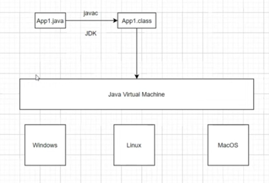

# Como o Java Funciona

## "Write once, run anywhere"

Você faz apenas um código para rodar em todos os sistemas operacionais, como Windows, Linux e MacOS. Isso é possível graças ao sistema de virtualização do Java, a JVM (Java Virtual Machine). 

O roda na JVM não é o "arquivo.java" e sim o "arquivo.class" que é gerado após a compilação (bytecode)

"arquivo.java" --> Arquivo que nós humanos conseguimos ler
"arquivo.class" --> bytecode que a JVM entende

o comando que usamos para compilar um arquivo ".java" é o "javac" (java compiler).

JDK (Java Developer Kit) --> Possui ferramentas para o desenvolvimento de um software como o javac, debugger e entre outras funcionalidades. O Java possui retrocompatibilidade, ou seja, a versão mais recente consegue rodar as versões anteriores.

JRE (Java Runtime Environment) --> Apenas roda programas ".class"

Portanto Java é considerado uma linguagem compilada e interpretada!
