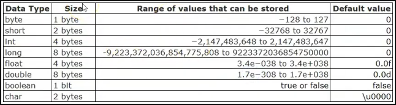

# Tipos primitivos
## Parte 02

- Todos os tipos primitivos são numéricos
- O que difere é o espaço de memória que cada uma ocupa

- Voce pode colocar valores da tabela ascii no tipo char para imprimir caracteres específicos